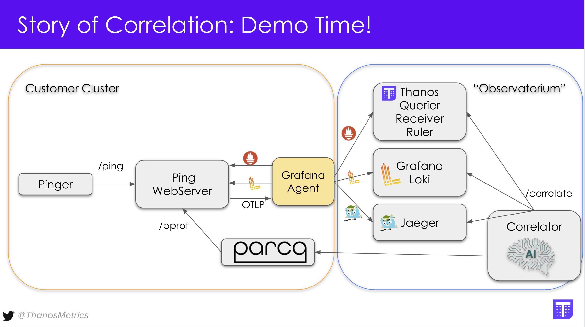

# correlator

A Prove of concept (PoC) of HTTP Service enabling smart correlations between cloud-native data.

## Description

This PoC was introduced in KubeConEU 2022 in the talk "Story of Correlation:
Integrating Thanos Metrics with Observability Signals" by [@kakkoyun](https://github.com/kakkoyun) and [@bwplotka](https://github.com/bwplotka)

Slides are available [here](https://docs.google.com/presentation/d/1FvMqgD5jL5_eoUs6CgIFiBS06U0Ge1CBSXZKz26fsac/edit#slide=id.ge46fc27f71_0_52)

## How to use the demo?

Requirements: `Go` installed in version 1.17 or higher.

1. From the root repo run `make docker` which will build two images: `ping` for demo service we observe and `correlator` which is our correlator microservice.

2. Run Go unit test located in [`examples/observability/observability_test.go`](https://github.com/bwplotka/correlator/blob/main/examples/observability/observability_test.go#L28). You can do that via your IDE or by running `go test -v -run "TestCorrelatorWithObservability" ./...`. NOTE this is interactive e2e tests implemented in https://github.com/efficientgo/e2e framework.

3. Once started this test should spin up the demo setup that looks as in the diagram below:

    

4. 6 browser tabs should open once setup started (within 10 seconds):
   1. Thanos UI showing alerts.
   2. Thanos UI allowing querying metrics.
   3. Grafana home UI.
   4. Jaeger UI allowing searching for traces.
   5. Parca UI allowing searching for profiles.
   6. Correlator UI allowing to pass Alerts.
5. You can pass firing Alert name from Thanos UI Alert tab (it should be firing after minute or two) to Correlator UI, which should return JSON response with useful links and descriptions. NOTE: We recommend using some JSON prettify Chrome plugin for link formatting.
6. You can cleanly terminate setup by clicking on URL provided in test output on line that starts with `"Waiting for user HTTP request on`. Alternatively copy this URL manually to browser. You should see EMPTY page. From now on the Go test should finish with "passed" status.

## Projects Used

> Projects are using Apache 2 License if not marked otherwise.

### Standalone Projects

* https://github.com/thanos-io/thanos
* https://github.com/jaegertracing/jaeger
* https://github.com/parca-dev/parca
* https://github.com/grafana/grafana (AGPL)
* https://github.com/grafana/loki (AGPL)
* https://github.com/grafana/agent

### Go Libraries

* https://github.com/prometheus/client_golang
* https://github.com/go-kit/log
* https://github.com/bwplotka/tracing-go
* https://github.com/efficientgo/e2e
